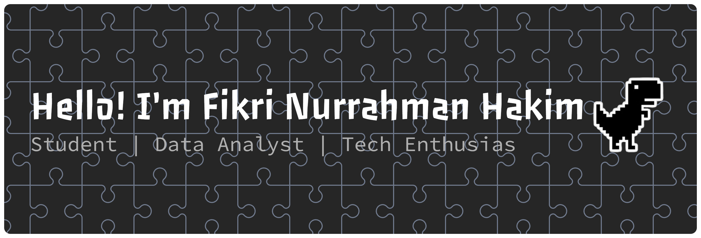

## Hello! I'am Fikri Nurrahman Hakim 👋

🔭 I’m currently working on DABI CAMP batch 4 by Celerates
🌱 I’m currently learning Data Analyst

#### Skills

       

##### Connect with me

##### My Github Stats

###

###

<picture data-importer="pacman">
  <source media="(prefers-color-scheme: dark)" srcset="https://raw.githubusercontent.com/Fikrinurh/Fikrinurh/pacman-output/pacman-contribution-graph-dark.svg?game=pacman">

  <source media="(prefers-color-scheme: light)" srcset="https://raw.githubusercontent.com/Fikrinurh/Fikrinurh/pacman-output/pacman-contribution-graph.svg?game=pacman">

  
</picture>

###

